# Architecture

This document describes the system architecture of the Gemini Multimodal RAG system, including component diagrams, data flows, database design, and key sequence diagrams.

## System Overview

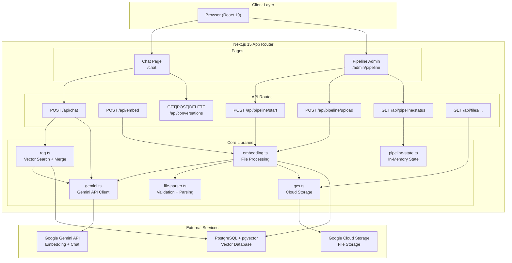

## Tech Stack Layers

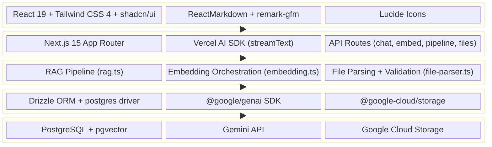

## Data Flow: Batch Embedding Pipeline

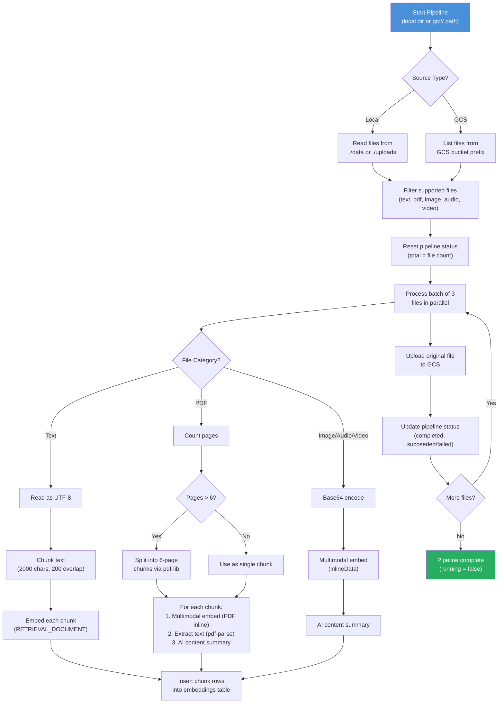

## Data Flow: Chat RAG Query

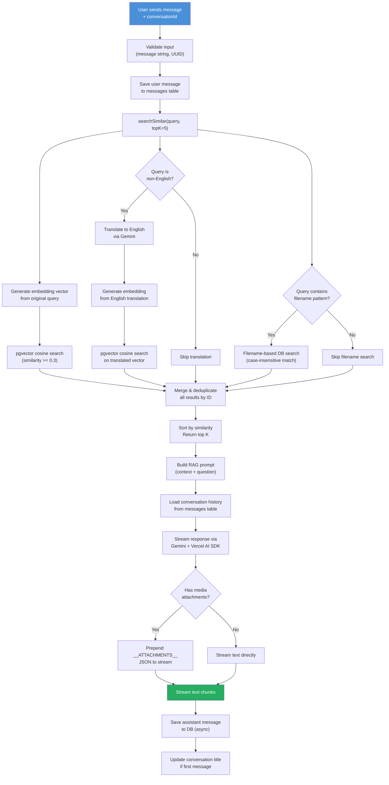

## Data Flow: Single File Embedding

```mermaid
flowchart LR
    A["POST /api/embed<br/>(multipart form)"] --> B["Validate file<br/>(exists, size <= 100MB,<br/>supported type)"]
    B --> C["Determine file category<br/>(text/pdf/image/audio/video)"]
    C --> D["Validate format<br/>against Gemini limits"]
    D --> E["Upload to GCS<br/>(uploads/uuid.ext)"]
    E --> F["Process by category"]
    F --> G["Generate embedding<br/>vector(s)"]
    G --> H["Insert into<br/>embeddings table"]
    H --> I["Return success<br/>{fileName, chunksCreated}"]
```

## Database Entity Relationship Diagram

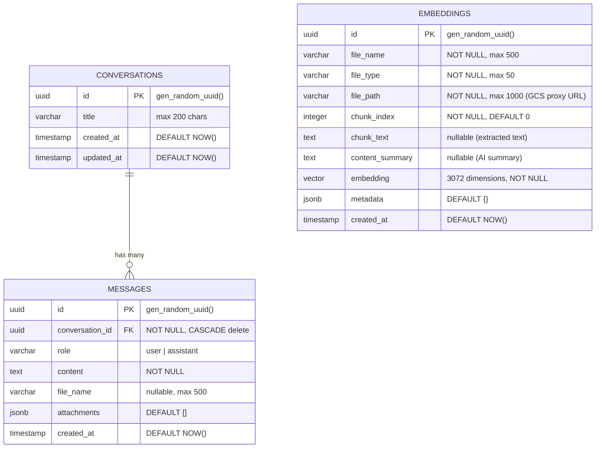

### Indexes

| Table | Index Name | Type | Columns / Expression |
|-------|-----------|------|---------------------|
| `embeddings` | `idx_embeddings_vector` | IVFFlat | `embedding vector_cosine_ops` (lists=100) |
| `embeddings` | `idx_embeddings_file_name` | B-tree | `file_name` |
| `messages` | `idx_messages_conversation` | B-tree | `(conversation_id, created_at)` |

## API Route Structure

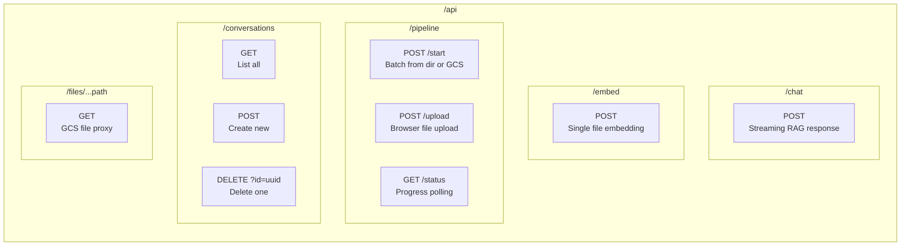

## Component Hierarchy

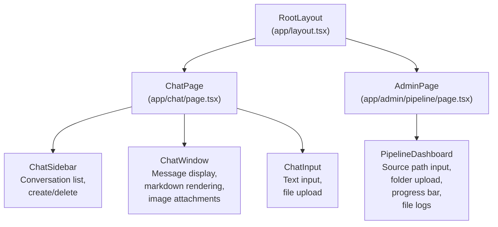

## Sequence Diagram: Chat Message Flow

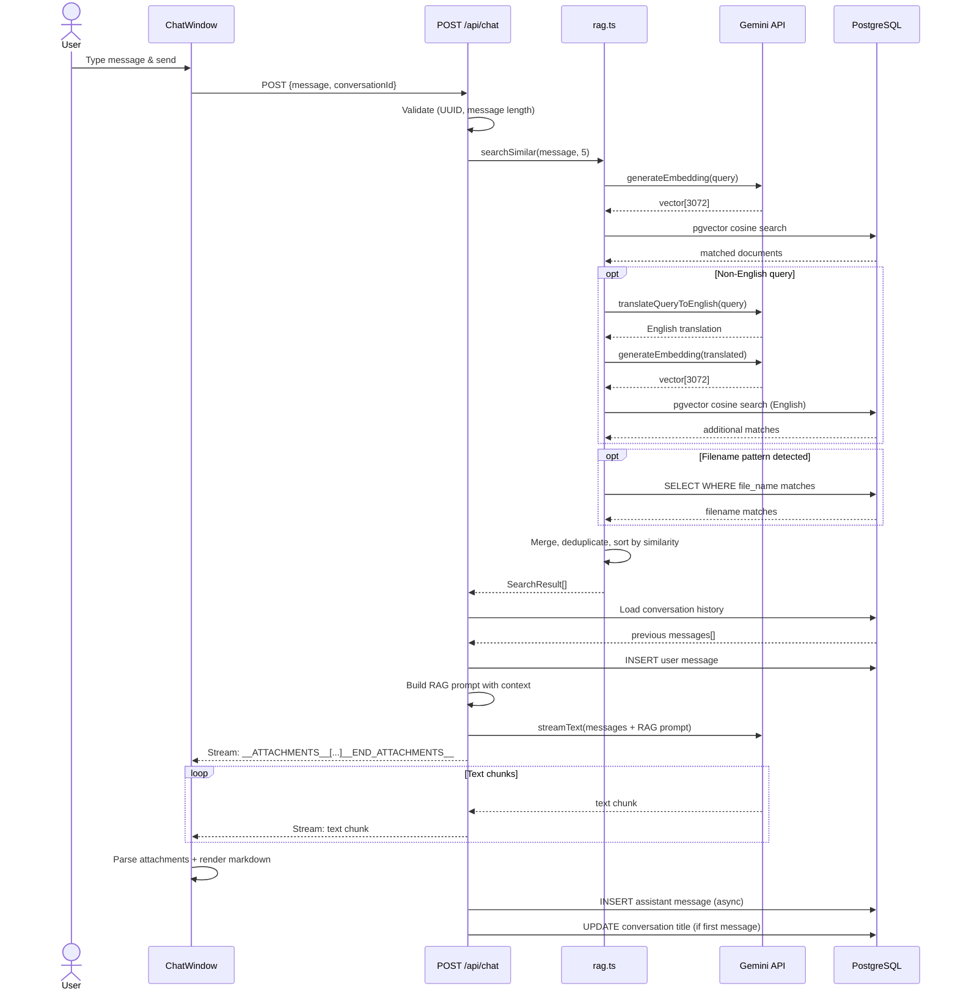

## Sequence Diagram: File Embedding Flow

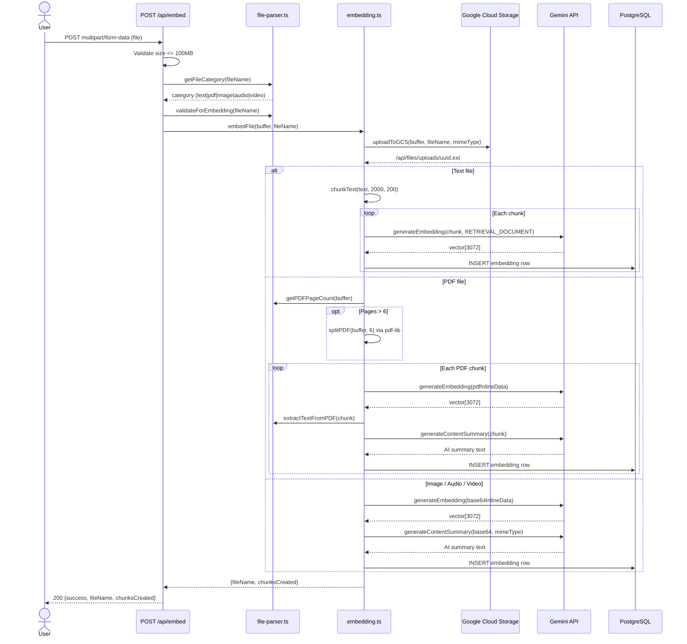

## Sequence Diagram: Batch Pipeline

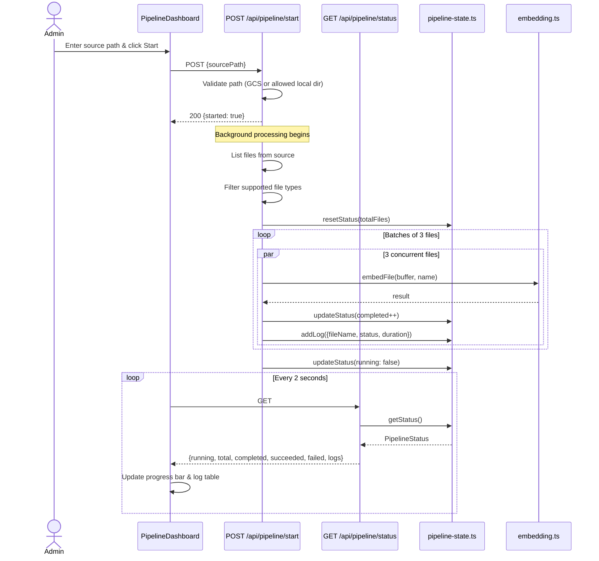

## Security Architecture

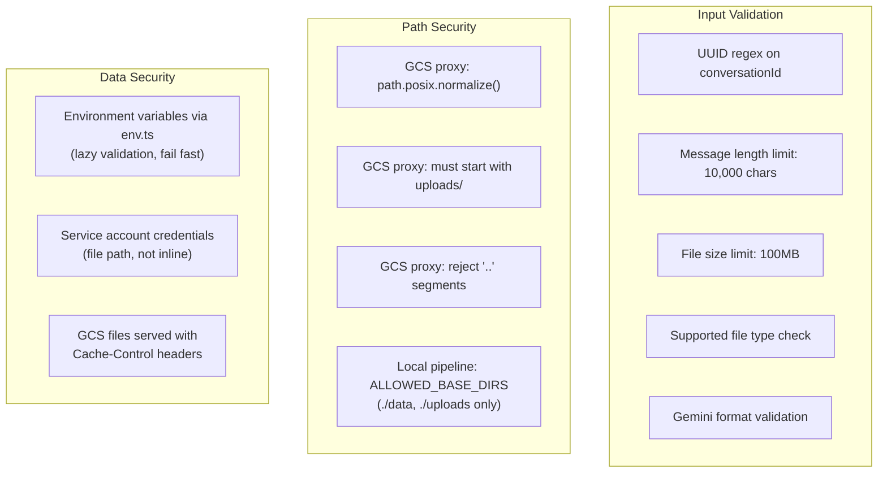
