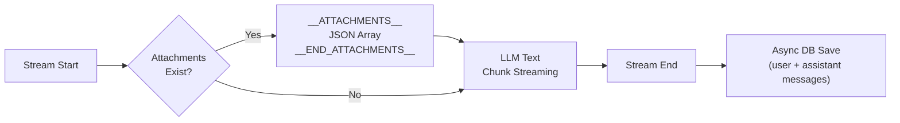

# API Reference

Detailed documentation for all API endpoints of the Gemini RAG system.

---

## Table of Contents

1. [Chat API](#1-chat-api)
2. [Embedding API](#2-embedding-api)
3. [Pipeline API](#3-pipeline-api)
4. [Conversation Management API](#4-conversation-management-api)
5. [File Proxy API](#5-file-proxy-api)
6. [Error Codes](#6-error-codes)
7. [Streaming Protocol](#7-streaming-protocol)

---

## 1. Chat API

### `POST /api/chat`

Performs a RAG-based chat query and returns a streaming response.

**Request Body (JSON)**

| Field | Type | Required | Description |
|---|---|---|---|
| `message` | `string` | Yes | User message (max 10,000 characters) |
| `conversationId` | `string` | Yes | Conversation UUID |

**Request Example**

```bash
curl -X POST http://localhost:3000/api/chat \
  -H "Content-Type: application/json" \
  -d '{
    "message": "Explain the architecture of this project",
    "conversationId": "550e8400-e29b-41d4-a716-446655440000"
  }'
```

**Response**: `ReadableStream` (text/plain; charset=utf-8)

The streaming response consists of two parts:

1. **Attachment prefix** (if related files are found):
   ```
   __ATTACHMENTS__[{"fileName":"doc.pdf","filePath":"path/to/doc.pdf","fileType":"pdf","similarity":0.85}]__END_ATTACHMENTS__
   ```

2. **Text stream**: LLM-generated text is sent in chunks.

**JavaScript (fetch) Example**

```javascript
const response = await fetch('/api/chat', {
  method: 'POST',
  headers: { 'Content-Type': 'application/json' },
  body: JSON.stringify({
    message: 'How does vector search work?',
    conversationId: '550e8400-e29b-41d4-a716-446655440000'
  })
});

const reader = response.body.getReader();
const decoder = new TextDecoder();
let fullText = '';

while (true) {
  const { done, value } = await reader.read();
  if (done) break;
  fullText += decoder.decode(value, { stream: true });
}

// Parse attachments
const attachmentMatch = fullText.match(
  /__ATTACHMENTS__(.*?)__END_ATTACHMENTS__/
);
if (attachmentMatch) {
  const attachments = JSON.parse(attachmentMatch[1]);
  const text = fullText.replace(
    /__ATTACHMENTS__.*?__END_ATTACHMENTS__/, ''
  );
}
```

**Error Responses**

| Status Code | Condition |
|---|---|
| `400` | `message` missing, empty string, or exceeds 10,000 characters |
| `400` | `conversationId` missing or UUID format mismatch |
| `500` | Internal server error (e.g., Gemini API failure) |

---

## 2. Embedding API

### `POST /api/embed`

Embeds a single file and stores it in the vector DB.

**Request Body**: `multipart/form-data`

| Field | Type | Required | Description |
|---|---|---|---|
| `file` | `File` | Yes | File to embed (max 100MB) |

**Request Example**

```bash
curl -X POST http://localhost:3000/api/embed \
  -F "file=@./document.pdf"
```

**Response (200 OK)**

```json
{
  "fileName": "document.pdf",
  "fileType": "pdf",
  "chunks": 3,
  "message": "Successfully embedded document.pdf"
}
```

**Processing by File Type**

| File Type | Processing Method | Chunking |
|---|---|---|
| Text (.txt, .md, .csv, etc.) | Text chunking followed by embedding each chunk | 2000 chars / 200 char overlap |
| PDF (.pdf) | Split into 6-page segments via pdf-lib, then multimodal embedding | 6-page units |
| Image (.png, .jpg) | Base64 multimodal embedding + AI summary | Single chunk |
| Audio (.mp3, .wav) | Base64 multimodal embedding + AI summary | Single chunk |
| Video (.mp4, .mov) | Base64 multimodal embedding + AI summary | Single chunk |

**Error Responses**

| Status Code | Condition |
|---|---|
| `400` | File missing or unsupported file format |
| `413` | File size exceeds 100MB |
| `500` | Embedding processing failure |

---

## 3. Pipeline API

### `POST /api/pipeline/start`

Starts a batch embedding pipeline.

**Request Body (JSON)**

| Field | Type | Required | Description |
|---|---|---|---|
| `source` | `string` | Yes | `"local"` or `"gcs"` |
| `path` | `string` | Yes | Directory path (local: only `./data` and `./uploads` subdirectories allowed / GCS: `gs://bucket/path`) |

**Request Example**

```bash
# Local directory
curl -X POST http://localhost:3000/api/pipeline/start \
  -H "Content-Type: application/json" \
  -d '{"source": "local", "path": "./data/documents"}'

# GCS path
curl -X POST http://localhost:3000/api/pipeline/start \
  -H "Content-Type: application/json" \
  -d '{"source": "gcs", "path": "gs://my-bucket/embeddings"}'
```

**Response (202 Accepted)**

```json
{
  "pipelineId": "pipe_abc123",
  "message": "Pipeline started",
  "totalFiles": 15
}
```

**Error Responses**

| Status Code | Condition |
|---|---|
| `400` | `source` or `path` missing, invalid `source` value |
| `403` | Local path is outside the allowed directories |
| `404` | No files found at the specified path |
| `409` | A pipeline is already running |
| `500` | Pipeline start failure |

---

### `POST /api/pipeline/upload`

Uploads a folder from the browser and runs the pipeline.

**Request Body**: `multipart/form-data`

| Field | Type | Required | Description |
|---|---|---|---|
| `files` | `File[]` | Yes | List of files to upload |

**Response (202 Accepted)**

```json
{
  "pipelineId": "pipe_def456",
  "message": "Upload pipeline started",
  "totalFiles": 8
}
```

---

### `GET /api/pipeline/status`

Retrieves the pipeline progress status. Used by the client in a polling manner.

**Query Parameters**

| Parameter | Type | Required | Description |
|---|---|---|---|
| `id` | `string` | Yes | Pipeline ID |

**Request Example**

```bash
curl "http://localhost:3000/api/pipeline/status?id=pipe_abc123"
```

**Response (200 OK)**

```json
{
  "pipelineId": "pipe_abc123",
  "status": "processing",
  "total": 15,
  "completed": 7,
  "failed": 1,
  "errors": [
    {"fileName": "corrupt.pdf", "error": "Invalid PDF format"}
  ],
  "currentFile": "report.pdf"
}
```

**Status Values (`status`)**

| Value | Description |
|---|---|
| `"pending"` | Pending |
| `"processing"` | Processing |
| `"completed"` | Completed |
| `"failed"` | Failed |

---

## 4. Conversation Management API

### `GET /api/conversations`

Retrieves a list of all conversations.

**Request Example**

```bash
curl http://localhost:3000/api/conversations
```

**Response (200 OK)**

```json
[
  {
    "id": "550e8400-e29b-41d4-a716-446655440000",
    "title": "About the RAG system",
    "createdAt": "2026-03-10T08:00:00.000Z",
    "updatedAt": "2026-03-10T09:30:00.000Z"
  }
]
```

---

### `POST /api/conversations`

Creates a new conversation.

**Request Body (JSON)**

| Field | Type | Required | Description |
|---|---|---|---|
| `title` | `string` | No | Conversation title (default: "New Conversation") |

**Request Example**

```bash
curl -X POST http://localhost:3000/api/conversations \
  -H "Content-Type: application/json" \
  -d '{"title": "Gemini API Analysis"}'
```

**Response (201 Created)**

```json
{
  "id": "660e9500-f30c-52e5-b827-557766551111",
  "title": "Gemini API Analysis",
  "createdAt": "2026-03-12T10:00:00.000Z",
  "updatedAt": "2026-03-12T10:00:00.000Z"
}
```

---

### `DELETE /api/conversations`

Deletes a conversation and its associated messages.

**Request Body (JSON)**

| Field | Type | Required | Description |
|---|---|---|---|
| `id` | `string` | Yes | UUID of the conversation to delete |

**Request Example**

```bash
curl -X DELETE http://localhost:3000/api/conversations \
  -H "Content-Type: application/json" \
  -d '{"id": "550e8400-e29b-41d4-a716-446655440000"}'
```

**Response (200 OK)**

```json
{
  "message": "Conversation deleted"
}
```

---

## 5. File Proxy API

### `GET /api/files/[...path]`

Proxies files stored in GCS to the client. Prevents path traversal attacks.

**Request Example**

```bash
curl http://localhost:3000/api/files/documents/report.pdf
```

**Response**

- On success: File binary data (with appropriate `Content-Type` header)
- `403 Forbidden`: Path traversal detected or unauthorized path
- `404 Not Found`: File does not exist in GCS

**Security Mechanisms**

1. Path normalization (`path.normalize()`)
2. Blocking paths containing `..`
3. `ALLOWED_GCS_PREFIX` validation to restrict access to allowed buckets/paths only

---

## 6. Error Codes

All APIs use a consistent error response format:

```json
{
  "error": "Error message"
}
```

### Common Error Codes

| HTTP Status Code | Meaning | Common Causes |
|---|---|---|
| `400` | Bad Request | Missing required parameters, invalid values, format errors |
| `403` | Forbidden | Path traversal attempt, unauthorized path access |
| `404` | Not Found | File/conversation not found |
| `409` | Conflict | A pipeline is already running |
| `413` | Payload Too Large | File size exceeds 100MB |
| `500` | Internal Server Error | Gemini API error, DB error, unexpected error |

---

## 7. Streaming Protocol

The `/api/chat` endpoint uses a custom streaming protocol.

### Response Structure

```
__ATTACHMENTS__<JSON array>__END_ATTACHMENTS__<LLM-generated text stream>
```

### Attachment Prefix Format

```
__ATTACHMENTS__[
  {
    "fileName": "architecture.png",
    "filePath": "uploads/architecture.png",
    "fileType": "image",
    "similarity": 0.87
  },
  {
    "fileName": "report.pdf",
    "filePath": "documents/report.pdf",
    "fileType": "pdf",
    "similarity": 0.75
  }
]__END_ATTACHMENTS__
```

### Attachment Object Schema

| Field | Type | Description |
|---|---|---|
| `fileName` | `string` | File name |
| `filePath` | `string` | File path in GCS (used as /api/files/ proxy path) |
| `fileType` | `string` | File type (pdf, image, audio, video, text) |
| `similarity` | `number` | Cosine similarity score (0-1) |

### Processing Order



### Client Parsing Logic

1. Detect the `__ATTACHMENTS__...__END_ATTACHMENTS__` pattern in the received full text
2. Extract that section and parse the JSON -> attachment array
3. Process the remaining text as the LLM response
4. Convert attachment `filePath` to `/api/files/{filePath}` to render images, etc.
