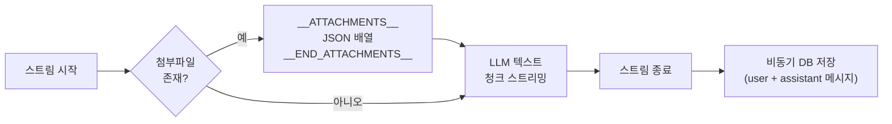

# API 레퍼런스

Gemini RAG 시스템의 모든 API 엔드포인트에 대한 상세 문서입니다.

---

## 목차

1. [채팅 API](#1-채팅-api)
2. [임베딩 API](#2-임베딩-api)
3. [파이프라인 API](#3-파이프라인-api)
4. [대화 관리 API](#4-대화-관리-api)
5. [파일 프록시 API](#5-파일-프록시-api)
6. [에러 코드](#6-에러-코드)
7. [스트리밍 프로토콜](#7-스트리밍-프로토콜)

---

## 1. 채팅 API

### `POST /api/chat`

RAG 기반 채팅 질의를 수행하고 스트리밍 응답을 반환합니다.

**요청 본문 (JSON)**

| 필드 | 타입 | 필수 | 설명 |
|---|---|---|---|
| `message` | `string` | O | 사용자 메시지 (최대 10,000자) |
| `conversationId` | `string` | O | 대화 UUID |

**요청 예제**

```bash
curl -X POST http://localhost:3000/api/chat \
  -H "Content-Type: application/json" \
  -d '{
    "message": "이 프로젝트의 아키텍처를 설명해주세요",
    "conversationId": "550e8400-e29b-41d4-a716-446655440000"
  }'
```

**응답**: `ReadableStream` (text/plain; charset=utf-8)

스트리밍 응답은 두 부분으로 구성됩니다:

1. **첨부파일 프리픽스** (검색된 관련 파일이 있을 경우):
   ```
   __ATTACHMENTS__[{"fileName":"doc.pdf","filePath":"path/to/doc.pdf","fileType":"pdf","similarity":0.85}]__END_ATTACHMENTS__
   ```

2. **텍스트 스트림**: LLM 생성 텍스트가 청크 단위로 전송됩니다.

**JavaScript (fetch) 예제**

```javascript
const response = await fetch('/api/chat', {
  method: 'POST',
  headers: { 'Content-Type': 'application/json' },
  body: JSON.stringify({
    message: '벡터 검색이 어떻게 동작하나요?',
    conversationId: '550e8400-e29b-41d4-a716-446655440000'
  })
});

const reader = response.body.getReader();
const decoder = new TextDecoder();
let fullText = '';

while (true) {
  const { done, value } = await reader.read();
  if (done) break;
  fullText += decoder.decode(value, { stream: true });
}

// 첨부파일 파싱
const attachmentMatch = fullText.match(
  /__ATTACHMENTS__(.*?)__END_ATTACHMENTS__/
);
if (attachmentMatch) {
  const attachments = JSON.parse(attachmentMatch[1]);
  const text = fullText.replace(
    /__ATTACHMENTS__.*?__END_ATTACHMENTS__/, ''
  );
}
```

**에러 응답**

| 상태 코드 | 조건 |
|---|---|
| `400` | `message` 누락, 빈 문자열, 10,000자 초과 |
| `400` | `conversationId` 누락 또는 UUID 형식 불일치 |
| `500` | 내부 서버 오류 (Gemini API 실패 등) |

---

## 2. 임베딩 API

### `POST /api/embed`

단일 파일을 임베딩하여 벡터 DB에 저장합니다.

**요청 본문**: `multipart/form-data`

| 필드 | 타입 | 필수 | 설명 |
|---|---|---|---|
| `file` | `File` | O | 임베딩할 파일 (최대 100MB) |

**요청 예제**

```bash
curl -X POST http://localhost:3000/api/embed \
  -F "file=@./document.pdf"
```

**응답 (200 OK)**

```json
{
  "fileName": "document.pdf",
  "fileType": "pdf",
  "chunks": 3,
  "message": "Successfully embedded document.pdf"
}
```

**파일 타입별 처리**

| 파일 타입 | 처리 방식 | 청킹 |
|---|---|---|
| 텍스트 (.txt, .md, .csv 등) | 텍스트 청킹 후 각 청크 임베딩 | 2000자 / 200자 오버랩 |
| PDF (.pdf) | pdf-lib로 6페이지 분할 후 멀티모달 임베딩 | 6페이지 단위 |
| 이미지 (.png, .jpg) | base64 멀티모달 임베딩 + AI 요약 | 단일 청크 |
| 오디오 (.mp3, .wav) | base64 멀티모달 임베딩 + AI 요약 | 단일 청크 |
| 비디오 (.mp4, .mov) | base64 멀티모달 임베딩 + AI 요약 | 단일 청크 |

**에러 응답**

| 상태 코드 | 조건 |
|---|---|
| `400` | 파일 누락, 지원하지 않는 파일 형식 |
| `413` | 파일 크기 100MB 초과 |
| `500` | 임베딩 처리 실패 |

---

## 3. 파이프라인 API

### `POST /api/pipeline/start`

배치 임베딩 파이프라인을 시작합니다.

**요청 본문 (JSON)**

| 필드 | 타입 | 필수 | 설명 |
|---|---|---|---|
| `source` | `string` | O | `"local"` 또는 `"gcs"` |
| `path` | `string` | O | 디렉토리 경로 (로컬: `./data`, `./uploads` 하위만 허용 / GCS: `gs://bucket/path`) |

**요청 예제**

```bash
# 로컬 디렉토리
curl -X POST http://localhost:3000/api/pipeline/start \
  -H "Content-Type: application/json" \
  -d '{"source": "local", "path": "./data/documents"}'

# GCS 경로
curl -X POST http://localhost:3000/api/pipeline/start \
  -H "Content-Type: application/json" \
  -d '{"source": "gcs", "path": "gs://my-bucket/embeddings"}'
```

**응답 (202 Accepted)**

```json
{
  "pipelineId": "pipe_abc123",
  "message": "Pipeline started",
  "totalFiles": 15
}
```

**에러 응답**

| 상태 코드 | 조건 |
|---|---|
| `400` | `source` 또는 `path` 누락, 잘못된 `source` 값 |
| `403` | 로컬 경로가 허용 디렉토리 외부 |
| `404` | 경로에 파일이 없음 |
| `409` | 이미 실행 중인 파이프라인 존재 |
| `500` | 파이프라인 시작 실패 |

---

### `POST /api/pipeline/upload`

브라우저에서 폴더를 업로드하여 파이프라인을 실행합니다.

**요청 본문**: `multipart/form-data`

| 필드 | 타입 | 필수 | 설명 |
|---|---|---|---|
| `files` | `File[]` | O | 업로드할 파일 목록 |

**응답 (202 Accepted)**

```json
{
  "pipelineId": "pipe_def456",
  "message": "Upload pipeline started",
  "totalFiles": 8
}
```

---

### `GET /api/pipeline/status`

파이프라인 진행 상태를 조회합니다. 클라이언트에서 폴링 방식으로 사용합니다.

**쿼리 파라미터**

| 파라미터 | 타입 | 필수 | 설명 |
|---|---|---|---|
| `id` | `string` | O | 파이프라인 ID |

**요청 예제**

```bash
curl "http://localhost:3000/api/pipeline/status?id=pipe_abc123"
```

**응답 (200 OK)**

```json
{
  "pipelineId": "pipe_abc123",
  "status": "processing",
  "total": 15,
  "completed": 7,
  "failed": 1,
  "errors": [
    {"fileName": "corrupt.pdf", "error": "Invalid PDF format"}
  ],
  "currentFile": "report.pdf"
}
```

**상태 값 (`status`)**

| 값 | 설명 |
|---|---|
| `"pending"` | 대기 중 |
| `"processing"` | 처리 중 |
| `"completed"` | 완료 |
| `"failed"` | 실패 |

---

## 4. 대화 관리 API

### `GET /api/conversations`

모든 대화 목록을 조회합니다.

**요청 예제**

```bash
curl http://localhost:3000/api/conversations
```

**응답 (200 OK)**

```json
[
  {
    "id": "550e8400-e29b-41d4-a716-446655440000",
    "title": "RAG 시스템에 대해",
    "createdAt": "2026-03-10T08:00:00.000Z",
    "updatedAt": "2026-03-10T09:30:00.000Z"
  }
]
```

---

### `POST /api/conversations`

새 대화를 생성합니다.

**요청 본문 (JSON)**

| 필드 | 타입 | 필수 | 설명 |
|---|---|---|---|
| `title` | `string` | X | 대화 제목 (기본: "새 대화") |

**요청 예제**

```bash
curl -X POST http://localhost:3000/api/conversations \
  -H "Content-Type: application/json" \
  -d '{"title": "Gemini API 분석"}'
```

**응답 (201 Created)**

```json
{
  "id": "660e9500-f30c-52e5-b827-557766551111",
  "title": "Gemini API 분석",
  "createdAt": "2026-03-12T10:00:00.000Z",
  "updatedAt": "2026-03-12T10:00:00.000Z"
}
```

---

### `DELETE /api/conversations`

대화와 관련 메시지를 삭제합니다.

**요청 본문 (JSON)**

| 필드 | 타입 | 필수 | 설명 |
|---|---|---|---|
| `id` | `string` | O | 삭제할 대화 UUID |

**요청 예제**

```bash
curl -X DELETE http://localhost:3000/api/conversations \
  -H "Content-Type: application/json" \
  -d '{"id": "550e8400-e29b-41d4-a716-446655440000"}'
```

**응답 (200 OK)**

```json
{
  "message": "Conversation deleted"
}
```

---

## 5. 파일 프록시 API

### `GET /api/files/[...path]`

GCS에 저장된 파일을 프록시하여 클라이언트에 제공합니다. 경로 순회 공격을 방지합니다.

**요청 예제**

```bash
curl http://localhost:3000/api/files/documents/report.pdf
```

**응답**

- 성공 시: 파일 바이너리 데이터 (적절한 `Content-Type` 헤더 포함)
- `403 Forbidden`: 경로 순회 감지 또는 허용되지 않은 경로
- `404 Not Found`: 파일이 GCS에 존재하지 않음

**보안 메커니즘**

1. 경로 정규화 (`path.normalize()`)
2. `..` 포함 경로 차단
3. `ALLOWED_GCS_PREFIX` 검증으로 허용된 버킷/경로만 접근

---

## 6. 에러 코드

모든 API는 일관된 에러 응답 형식을 사용합니다:

```json
{
  "error": "에러 메시지"
}
```

### 공통 에러 코드

| HTTP 상태 코드 | 의미 | 일반적인 원인 |
|---|---|---|
| `400` | Bad Request | 필수 파라미터 누락, 유효하지 않은 값, 형식 오류 |
| `403` | Forbidden | 경로 순회 시도, 허용되지 않은 경로 접근 |
| `404` | Not Found | 파일/대화를 찾을 수 없음 |
| `409` | Conflict | 이미 실행 중인 파이프라인 |
| `413` | Payload Too Large | 파일 크기 100MB 초과 |
| `500` | Internal Server Error | Gemini API 오류, DB 오류, 예상치 못한 오류 |

---

## 7. 스트리밍 프로토콜

`/api/chat` 엔드포인트는 커스텀 스트리밍 프로토콜을 사용합니다.

### 응답 구조

```
__ATTACHMENTS__<JSON 배열>__END_ATTACHMENTS__<LLM 생성 텍스트 스트림>
```

### 첨부파일 프리픽스 형식

```
__ATTACHMENTS__[
  {
    "fileName": "architecture.png",
    "filePath": "uploads/architecture.png",
    "fileType": "image",
    "similarity": 0.87
  },
  {
    "fileName": "report.pdf",
    "filePath": "documents/report.pdf",
    "fileType": "pdf",
    "similarity": 0.75
  }
]__END_ATTACHMENTS__
```

### 첨부파일 객체 스키마

| 필드 | 타입 | 설명 |
|---|---|---|
| `fileName` | `string` | 파일 이름 |
| `filePath` | `string` | GCS 내 파일 경로 (/api/files/ 프록시 경로로 사용) |
| `fileType` | `string` | 파일 타입 (pdf, image, audio, video, text) |
| `similarity` | `number` | 코사인 유사도 점수 (0~1) |

### 처리 순서



### 클라이언트 파싱 로직

1. 수신된 전체 텍스트에서 `__ATTACHMENTS__...__END_ATTACHMENTS__` 패턴 감지
2. 해당 부분을 추출하여 JSON 파싱 -> 첨부파일 배열
3. 나머지 텍스트를 LLM 응답으로 처리
4. 첨부파일의 `filePath`를 `/api/files/{filePath}`로 변환하여 이미지 등 렌더링
