# 아키텍처 문서

Gemini RAG 시스템의 전체 아키텍처를 설명합니다. 모든 다이어그램은 Mermaid 문법으로 작성되었습니다.

---

## 1. 시스템 개요

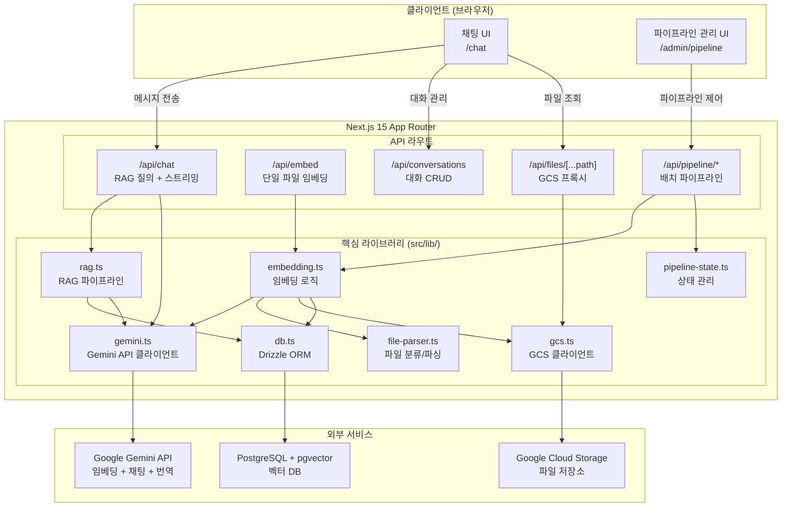

---

## 2. 기술 스택 레이어

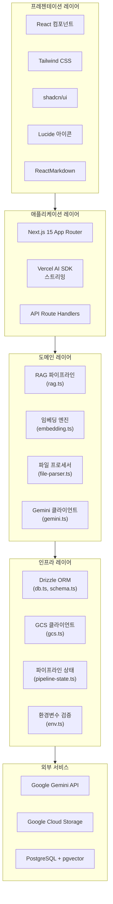

---

## 3. 데이터 플로우

### 3.1 배치 임베딩 파이프라인

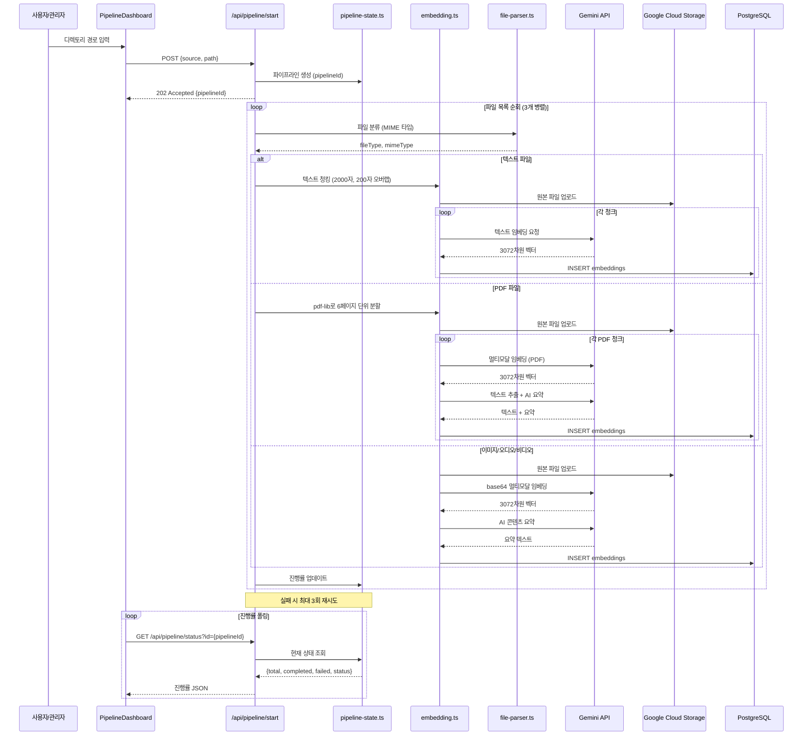

### 3.2 채팅 RAG 질의 플로우

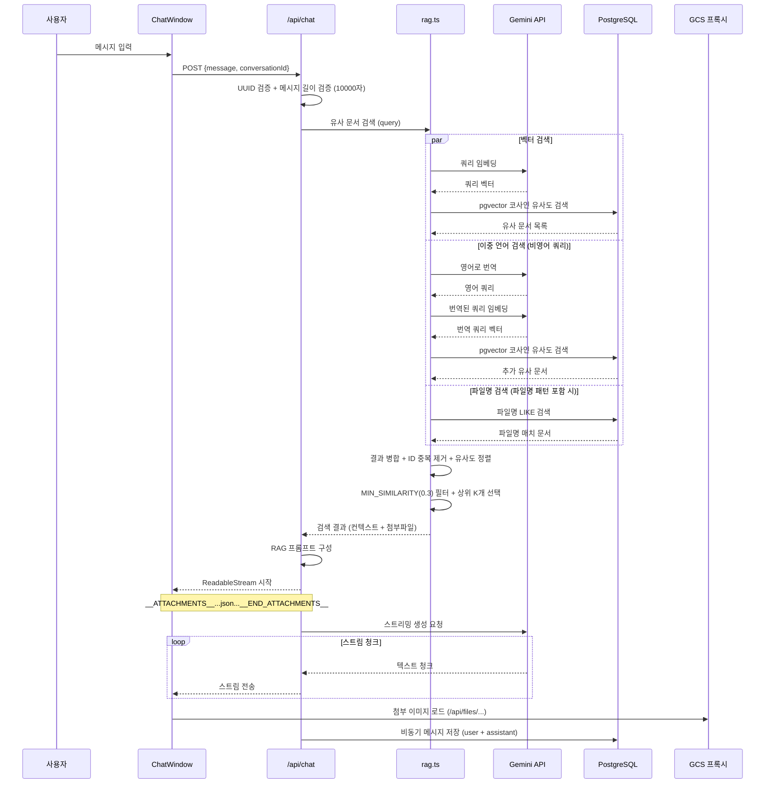

### 3.3 단일 파일 임베딩 플로우

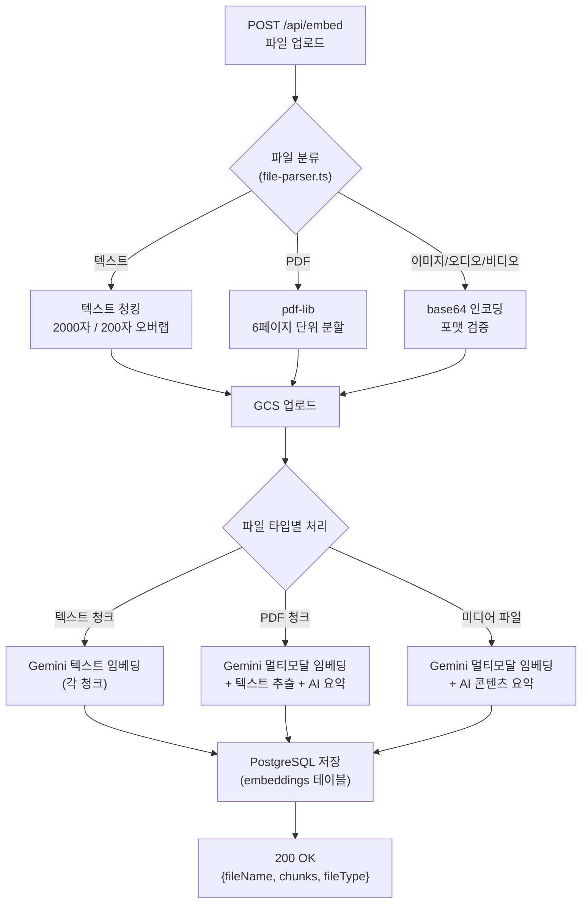

---

## 4. 데이터베이스 ER 다이어그램

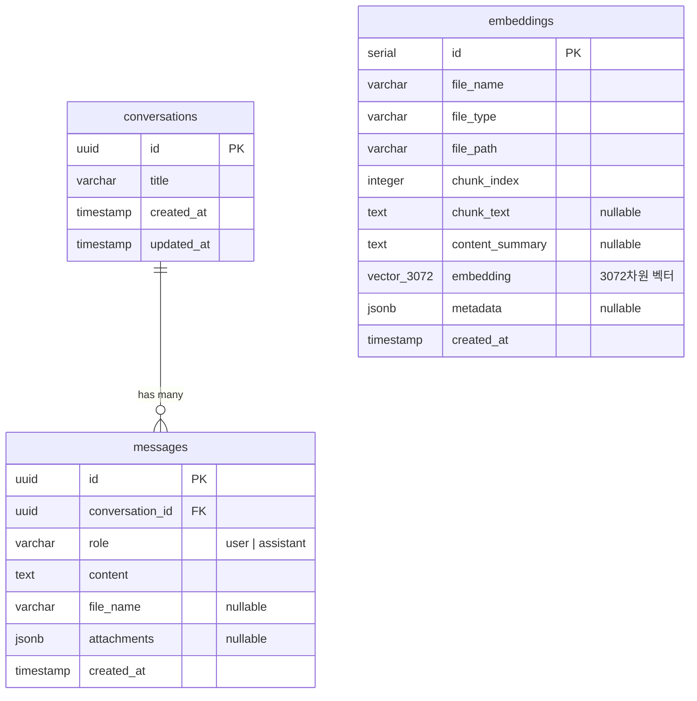

### 인덱스 구조

| 테이블 | 인덱스 | 타입 | 대상 컬럼 |
|---|---|---|---|
| `embeddings` | `embedding_idx` | IVFFlat (코사인) | `embedding` |
| `embeddings` | `file_name_idx` | B-tree | `file_name` |
| `messages` | `conv_created_idx` | B-tree (복합) | `conversation_id, created_at` |

---

## 5. API 라우트 구조

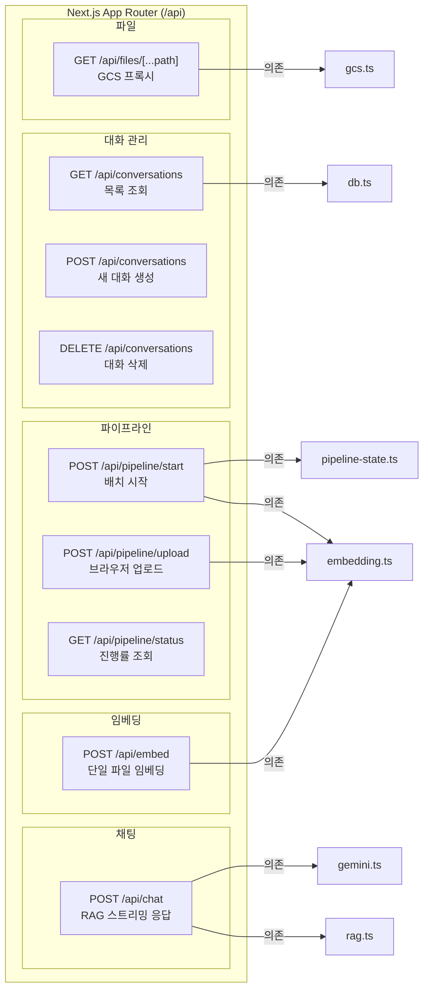

---

## 6. 컴포넌트 계층 다이어그램

---

## 7. 주요 시퀀스 다이어그램

### 7.1 대화 생성 및 첫 메시지 전송

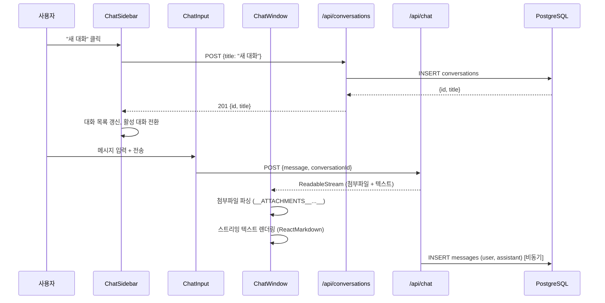

### 7.2 파일 업로드 후 임베딩

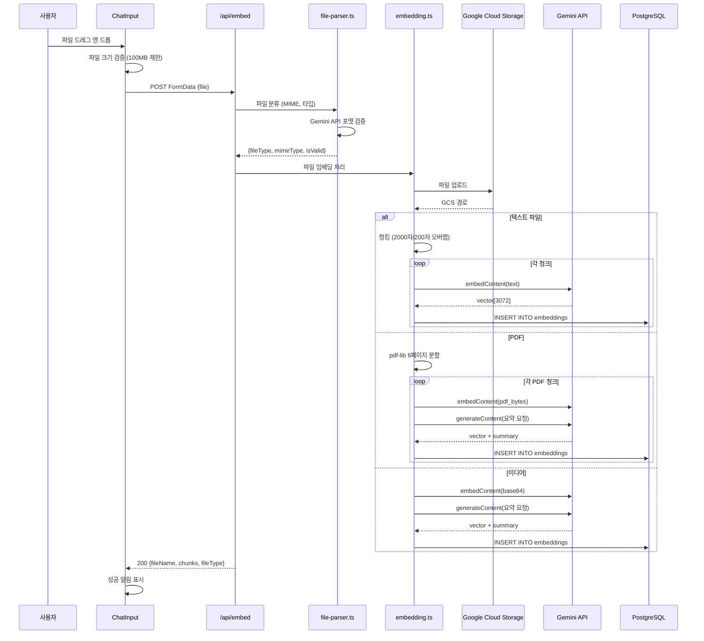

### 7.3 GCS 파일 프록시 요청

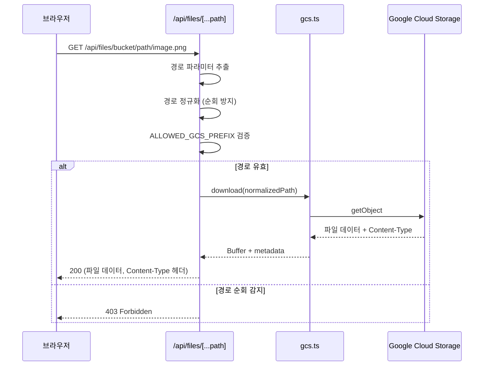

---

## 8. 보안 아키텍처

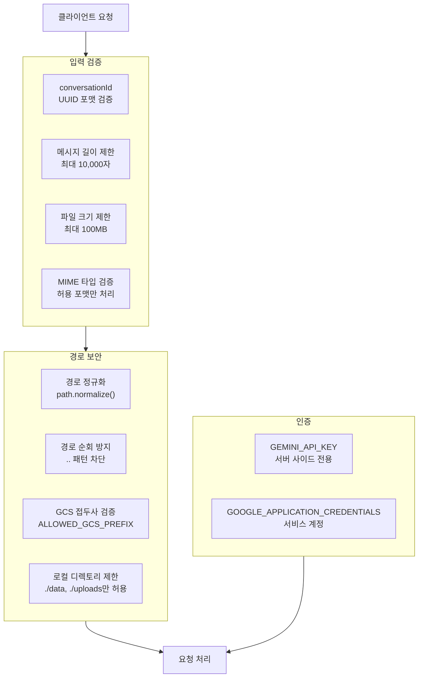
