# Architecture Document

Describes the overall architecture of the Gemini RAG system. All diagrams are written in Mermaid syntax.

---

## 1. System Overview

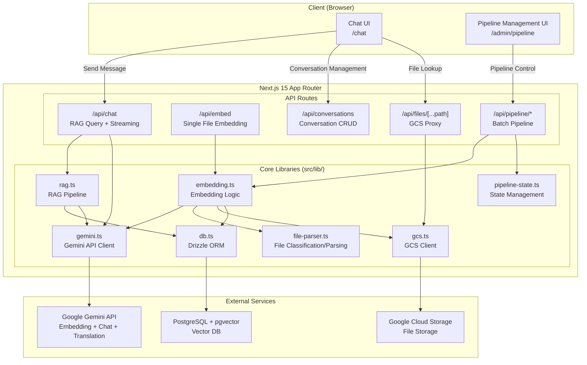

---

## 2. Technology Stack Layers

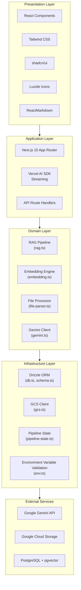

---

## 3. Data Flow

### 3.1 Batch Embedding Pipeline

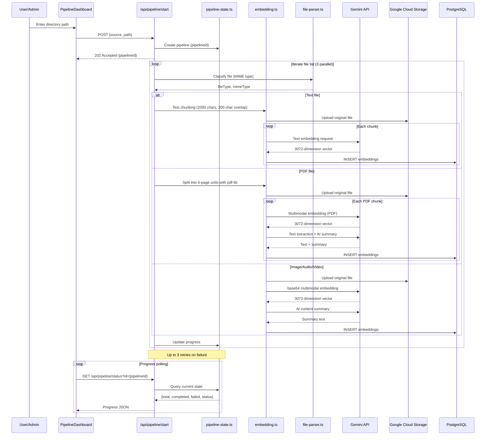

### 3.2 Chat RAG Query Flow

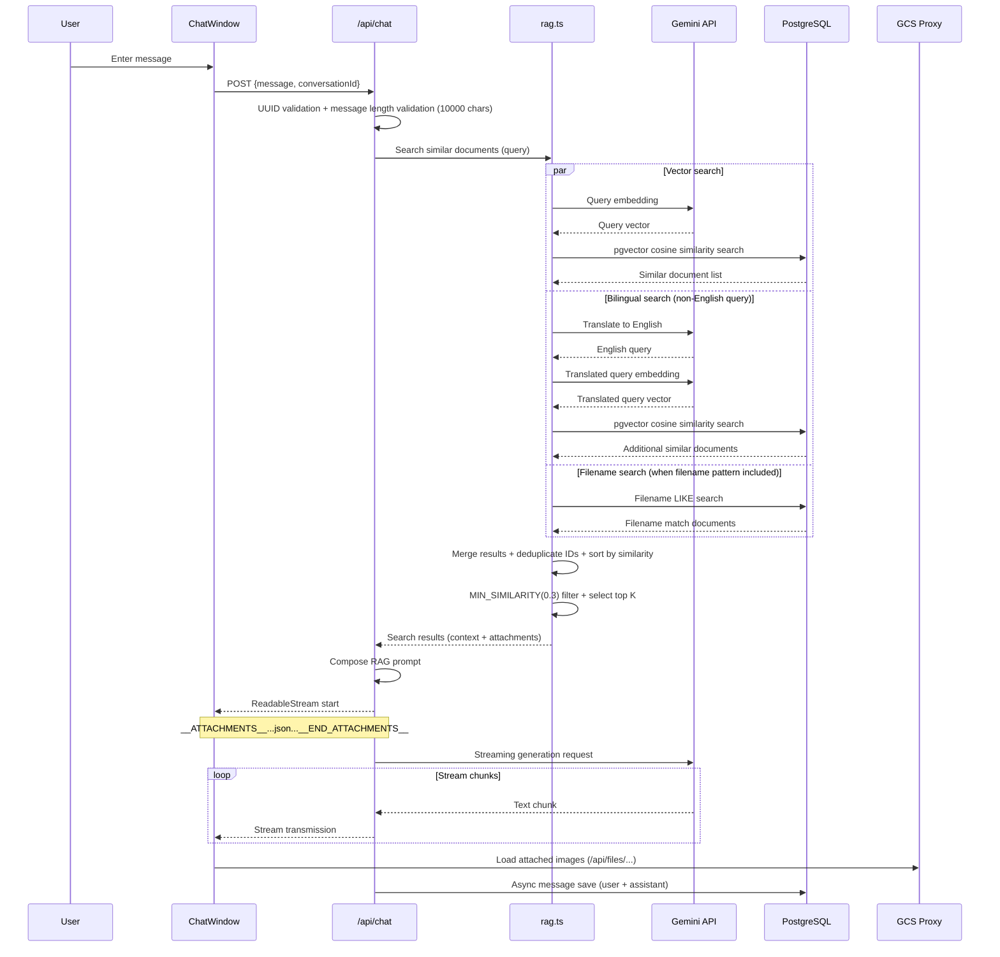

### 3.3 Single File Embedding Flow

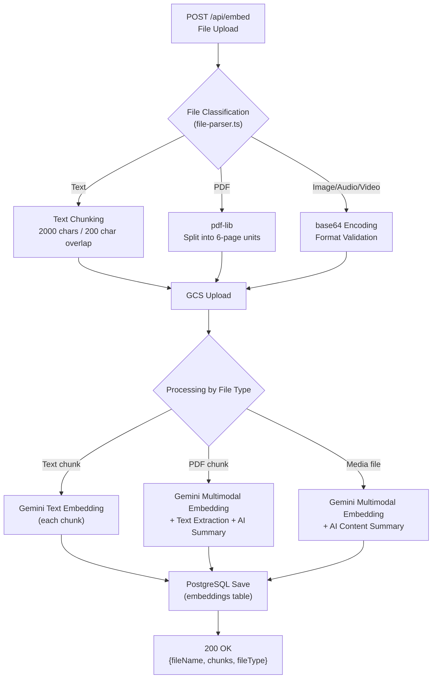

---

## 4. Database ER Diagram

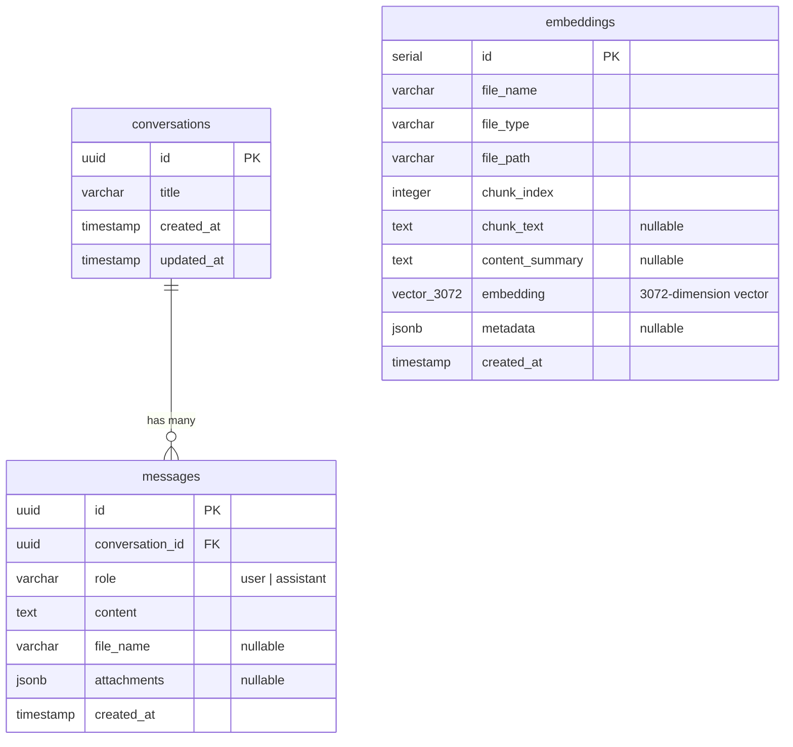

### Index Structure

| Table | Index | Type | Target Column |
|---|---|---|---|
| `embeddings` | `embedding_idx` | IVFFlat (cosine) | `embedding` |
| `embeddings` | `file_name_idx` | B-tree | `file_name` |
| `messages` | `conv_created_idx` | B-tree (composite) | `conversation_id, created_at` |

---

## 5. API Route Structure

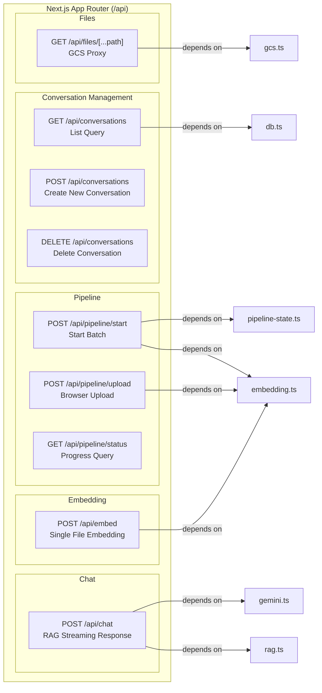

---

## 6. Component Hierarchy Diagram

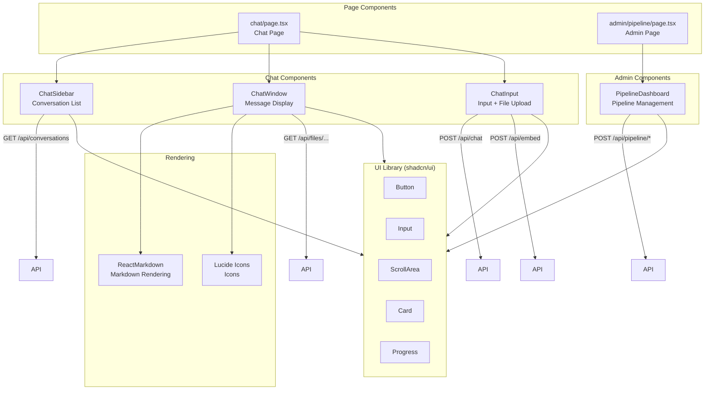

---

## 7. Key Sequence Diagrams

### 7.1 Conversation Creation and First Message

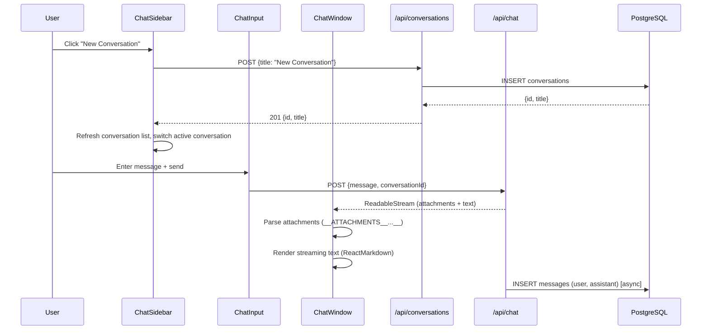

### 7.2 File Upload and Embedding

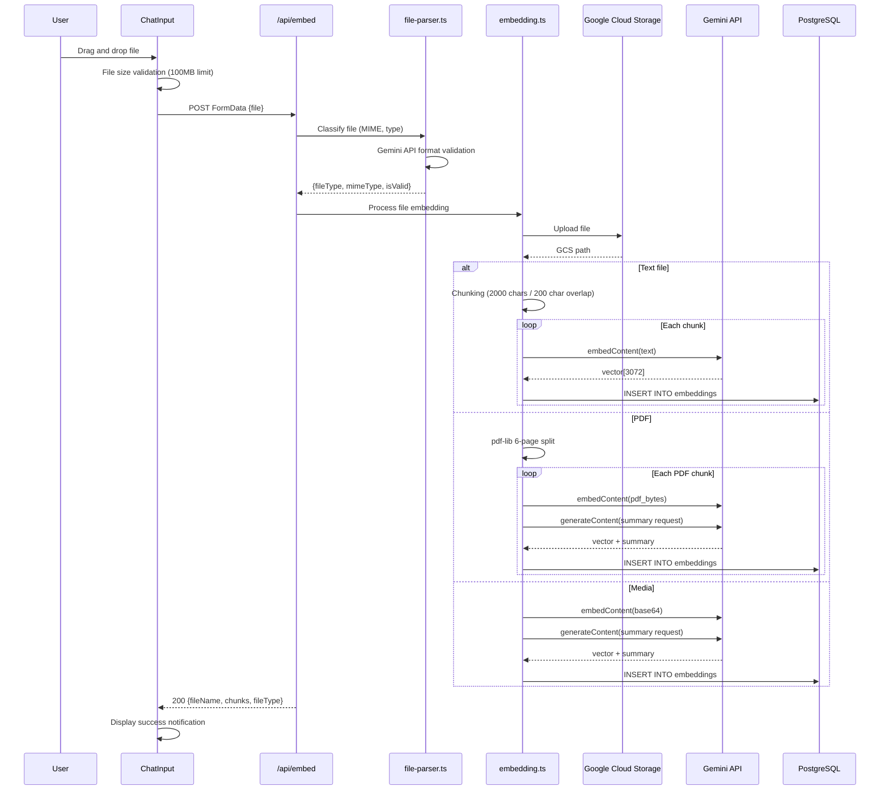

### 7.3 GCS File Proxy Request

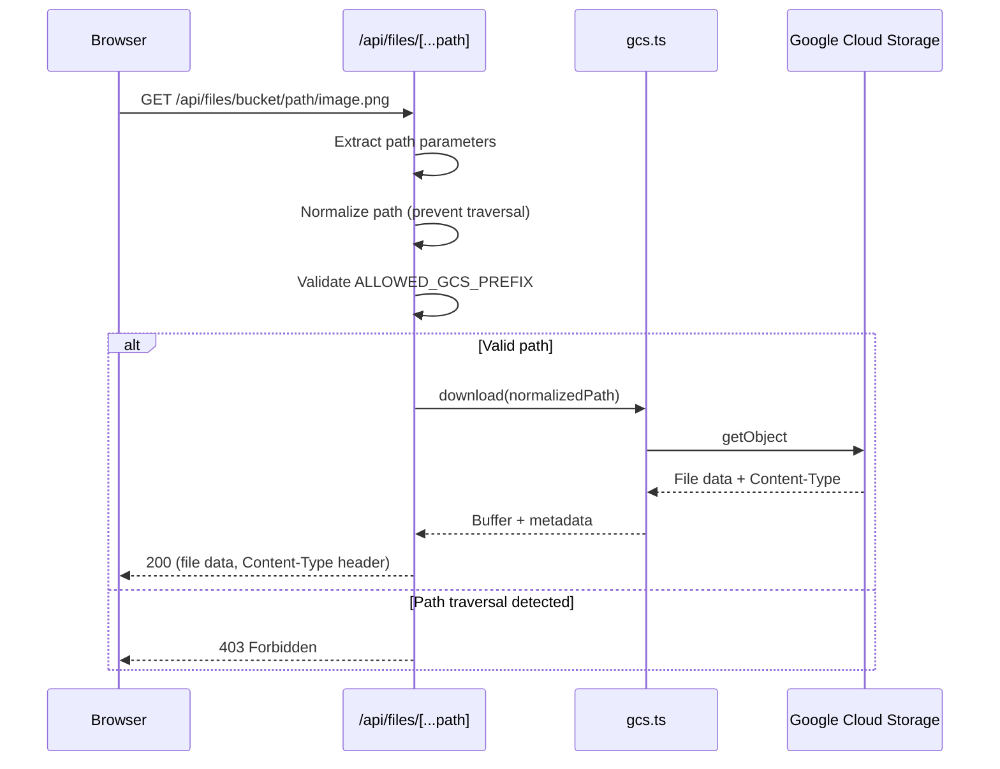

---

## 8. Security Architecture

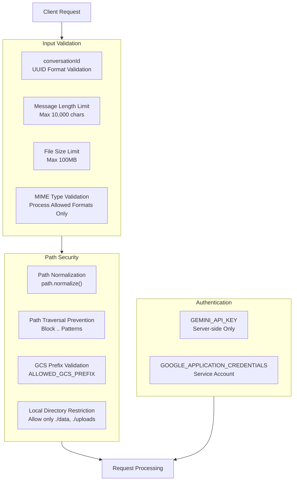
